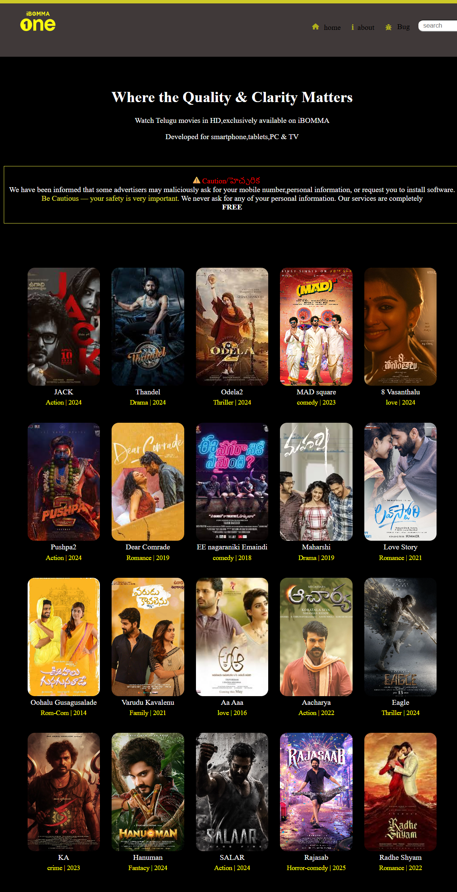

# iBOMMA-Clone
🎥 iBomma Clone – HTML & CSS Frontend
This project is a frontend clone of the popular iBomma movie streaming site, built entirely using HTML and CSS. It's a static project that replicates the layout, design, and basic interactivity of the original site.

🔗 Live Preview

👉 View Live Site on Netlify
Hosting: https://magenta-moxie-ce58ca.netlify.app/

📸 Preview

You can add a screenshot here:

💡 Features

Fully responsive homepage layout
Navigation bar with home, about, and bug-report icons
Search bar with styled input and search icon
Movie grid displaying posters, titles, genres, and years
Hover effects for movie posters
Caution box styled similar to the original iBomma warning

🛠️ Technologies Used

HTML5 for structure
CSS3 for styling and layout
Font Awesome for icons
Netlify for hosting

📁 Project Structure

📦 ibomma-clone/
 ┣ 📜 index.html
 ┣ 📜 ibomma.html (inline css)
 ┣ 📁 assets/ (images)
     ┣ 📄 p1.jpg, p2.jpg, ..., pk.jpg
     
     
🚀 How to Use

Clone this repo:
git clone https://github.com/your-username/ibomma-clone.git
Open index.html in your browser to preview the site.

📌 Disclaimer

This project is created for educational purposes only. It is not affiliated with or endorsed by the actual iBomma website. All images and links are used for demonstration only.
